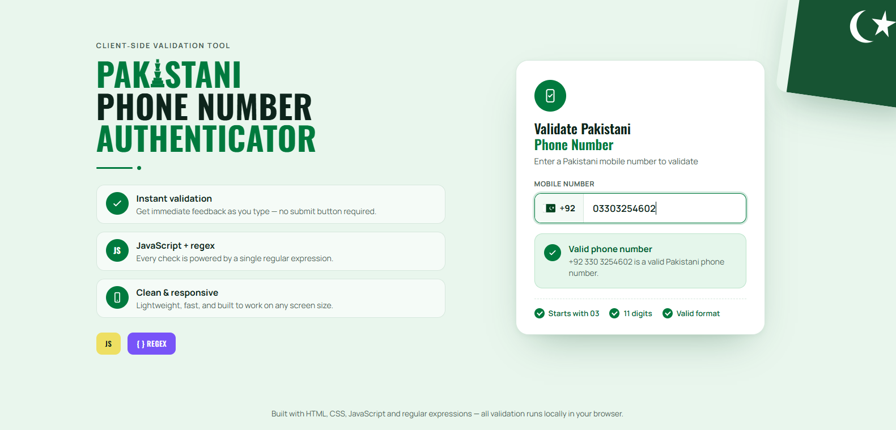

# 📱 Pakistani Phone Number Authenticator

**Live, client-side validation for Pakistani mobile numbers — powered by a single regular expression.**

Type a number and watch it validate instantly, no submit button, no server round-trip. Built to correctly recognize Pakistan's mobile format (`03XXXXXXXXX`) regardless of how the user enters it — with or without the `+92` country code or leading zero.

<p>
  
  
  
</p>

---

## ✨ Features

- **Instant, live validation** — feedback updates on every keystroke, no submit button required.
- **Single-regex core** — the entire validity check is one expression, `/^03\d{9}$/`, matched against the normalized local number.
- **Smart input normalization** — strips non-digit characters and transparently handles a leading `92` country code or `0` trunk prefix, so `+923012345678`, `923012345678`, and `03012345678` are all recognized as the same number.
- **Fixed +92 prefix** — the country code is shown as a permanent, non-editable prefix next to the input, matching how Pakistani numbers are actually dialed internationally.
- **Readable formatted output** — valid numbers are echoed back in a clean `+92 3XX XXXXXXX` format.
- **Per-rule checklist** — three independent indicators (`Starts with 03`, `11 digits`, `Valid format`) show exactly which rule is passing or failing as you type.
- **Specific error messaging** — tells you exactly what's wrong: wrong prefix, too few digits (with a live count of how many more are needed), or too many digits.
- **Idle, valid, and invalid states** — the input border, result panel, and icon all change color and content to reflect the current state.
- **Clean & responsive design** — a two-column hero layout with a Pakistan-flag accent, built with Manrope and Oswald, that adapts down to a single column on smaller screens.
- **100% client-side** — no backend, no network requests, no data collection. Every check runs locally in the browser.

## 🖥️ Preview

<p align="center">
  
</p>

## 🚀 Getting Started

This is a single self-contained web page — no build step, no package installation.

### Option 1: Open directly
```bash
git clone https://github.com/wasay-khanzada/Pakistani-Phone-Number-Authenticator.git
cd Pakistani-Phone-Number-Authenticator
open index.html   # macOS
# or just double-click index.html on Windows/Linux
```

### Option 2: Serve locally
```bash
npx serve .
# or
python3 -m http.server 8000
```
Then visit `http://localhost:PORT`.

### Option 3: GitHub Pages
Enable GitHub Pages on the `main` branch (root) in the repository settings for a live, shareable link.

## 📝 Usage

1. Start typing a mobile number into the input field (e.g. `3012345678`, `03012345678`, or `923012345678`).
2. Watch the result panel and checklist update live.
3. A green check means the number matches Pakistan's `03XXXXXXXXX` mobile format; a red cross explains exactly what to fix.

## ✅ Validation Rules

A number is considered valid when, after normalization, it:

1. Starts with `03`
2. Is exactly **11 digits** long
3. Fully matches `^03\d{9}$`

Before checking, the input is normalized by stripping all non-digit characters and removing an optional leading `92` (country code) or `0` (trunk prefix), so the user can type the number in whichever form feels natural.

## 🛠️ Tech Stack

- HTML5 & CSS3 (no frameworks) — Manrope (body) and Oswald (display) via Google Fonts
- Vanilla JavaScript (no libraries) — a single regular expression drives all validation logic
- No external APIs, no build tools

## 📁 Project Structure

```
Pakistani-Phone-Number-Authenticator/
├── index.html   # markup and structure
├── style.css    # design system and layout
└── script.js    # normalization, validation, and rendering logic
```

## 🤝 Contributing

Contributions are welcome! Please read [CONTRIBUTING.md](CONTRIBUTING.md) for guidelines on how to get started.

## 📜 License

This project is licensed under the [MIT License](LICENSE).

## 🙋 Author

**Abdul Wasay Khan**
[Portfolio](https://abdul-wasay-khan-portfolio.netlify.app) · [GitHub](https://github.com/wasay-khanzada)

---

If you find this tool useful, consider giving the repo a ⭐ — it helps others find it too.
